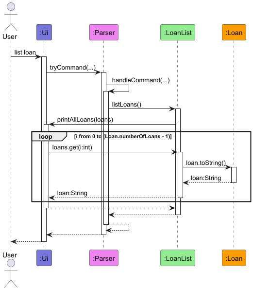
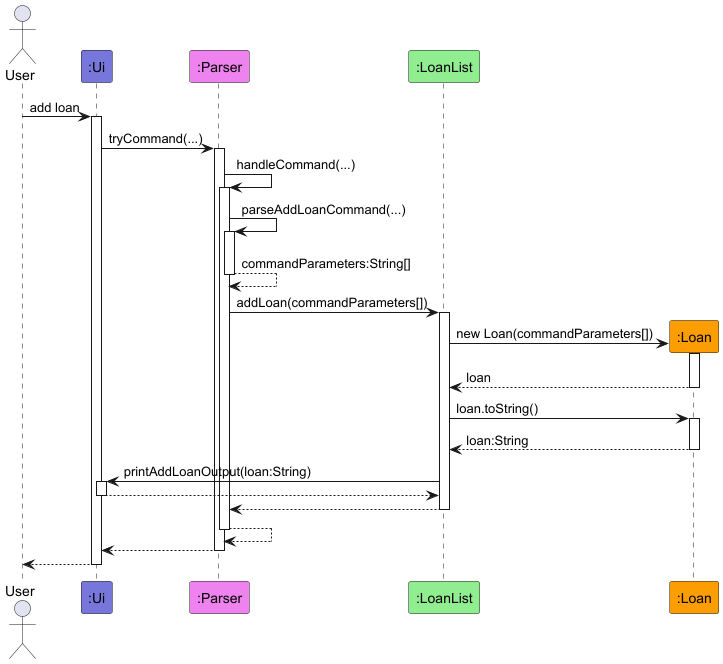
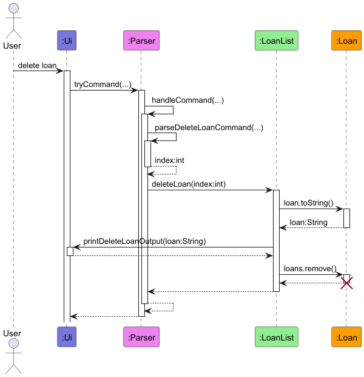
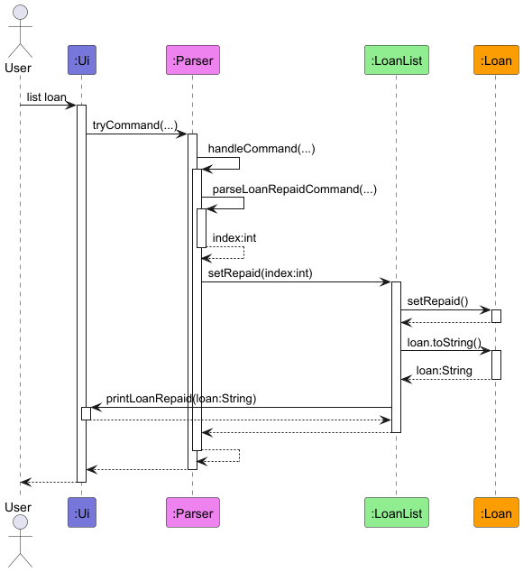
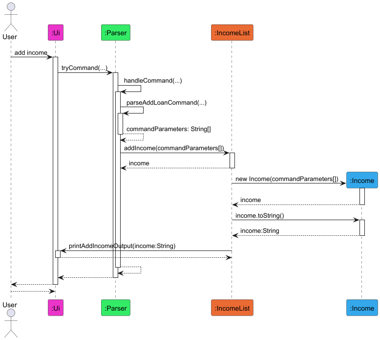

# Developer Guide

## Acknowledgements

{list here sources of all reused/adapted ideas, code, documentation, and third-party libraries -- include links to the original source as well}

## Design & implementation

{Describe the design and implementation of the product. Use UML diagrams and short code snippets where applicable.}

### 1. Design

> [!TIP]
>
> The `.puml` files used to create diagrams are in the `docs/uml` folder. The diagrams can be found in the `docs/diagrams` folder. Refer to the [_PlantUML Tutorial_ at se-edu/guides](https://se-education.org/guides/tutorials/plantUml.html) to learn how to create and edit diagrams.

Main components of the architecture

`Finsight` is in charge of the program launch and shutdown

* At app launch, it initializes the other components and connects them up with each other
* At shut down, it shuts down the other components and invokes cleanup methods wherever necessary

The bulk of the app's work is done by the following four components

* `UI` : The UI of the App.
* `Parser` : The command executor and handler
* `Storage` : Reads fata from, and writes data to, the hard disk

### 2. Implementation

#### 2.1 Loan Features

##### 2.1.1 List Loan Feature
The List Loan feature enables users to see a list of loans. The `Ui` class takes in the user input. This String is used by the `Parser` class to decide which command to run. `Parser` calls the `listLoans()` method from the `LoanList` class to output the loans. `LoanList` then calls the `Ui` class to output the loans, giving it the ArrayList of Loans. `Ui` class loops through the ArrayList to output each `Loan` class's `toString()` method.

##### 2.1.2 Add Loan Feature
The Add Loan feature enables users to add loans. The `Ui` class takes in the user input. This String is used by the `Parser` class to decide which command to run. `Parser` validates the provided description, amount and date time using the `parseAddLoanCommand` method. `Parser` then calls the `addLoan()` method of the `LoanList` class which creates and add the given `Loan` if valid. Below is the relevance of these attributes:

| Class Attribute | Variable Type | Relevance                                 |
|-----------------|---------------|-------------------------------------------|
| description     | String        | The short description of the loan         |
| amountLoaned    | Double        | The amount loaned                         |
| loanReturnDate  | LocalDateTime | The date and time that the loan is due by |

The `LoanList` class then calls the `Ui` class to print a acknowledgement message in the form of the `toString()` method of the `Loan` class.

##### 2.1.3 Delete Loan Feature
The Delete Loan feature enables the users to delete a loan. The `Ui` class takes in the user input. This String is used by the `Parser` class to decide which command to run. `Parser` validates the provided index using the `parseDeleteLoanCommand` method. `Parser` then calls the `deleteLoan()` method of the `LoanList` class which calls the `Ui` class to print a acknowledgement message using the `toString()` method of the `Loan` class before deleting the `Loan` at the given index. Below is the relevance of these attributes:

| Class Attribute | Variable Type | Relevance                              |
|-----------------|---------------|----------------------------------------|
| index           | int           | The index of the Loan in the ArrayList |

##### 2.1.4 Loan Repaid Feature
The Loan Repaid feature enables the users to set a loan as repaid. The `Ui` class takes in the user input. This String is used by the `Parser` class to decide which command to run. `Parser` validates the provided index using the `parseLoanRepaidCommand` method. `Parser` then calls the `setRepaid()` method of the `LoanList` class which calls the `setRepaid()` method of the `Loan` class before calling the `Ui` class to print a acknowledgement message using the `toString()` method of the `Loan` class. Below is the relevance of these attributes:

| Class Attribute | Variable Type | Relevance                              |
|-----------------|---------------|----------------------------------------|
| index           | int           | The index of the Loan in the ArrayList |

#### 3.1 Income Features

##### 3.1.1 Add Income Feature
The Add Income feature enables users to add income.

##### 3.1.2 Delete Income Feature
The Delete Income feature enables users to delete income.

##### 3.1.3 Edit Income Feature
The Edit Income feature enables users to edit income.

##### 3.1.4 List Income Feature
The List Income feature enables users to view all incomes.

## Product scope
### Target user profile

{Describe the target user profile}

### Value proposition

{Describe the value proposition: what problem does it solve?}

## User Stories

|Version| As a ... | I want to ... | So that I can ...|
|--------|----------|---------------|------------------|
|v1.0|new user|see usage instructions|refer to them when I forget how to use the application|
|v2.0|user|find a to-do item by name|locate a to-do without having to go through the entire list|

## Non-Functional Requirements

{Give non-functional requirements}

## Glossary

* *glossary item* - Definition

## Instructions for manual testing

{Give instructions on how to do a manual product testing e.g., how to load sample data to be used for testing}
