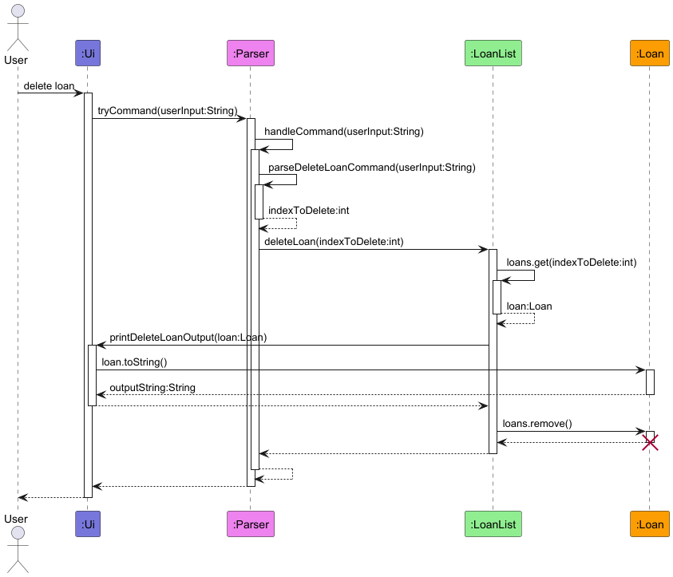
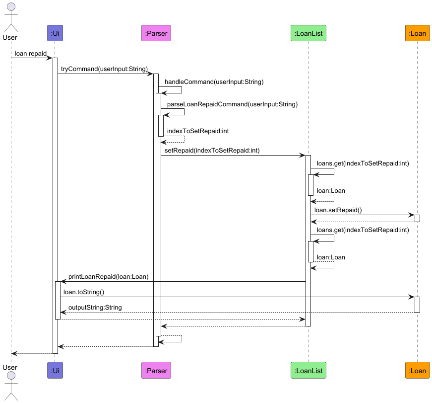
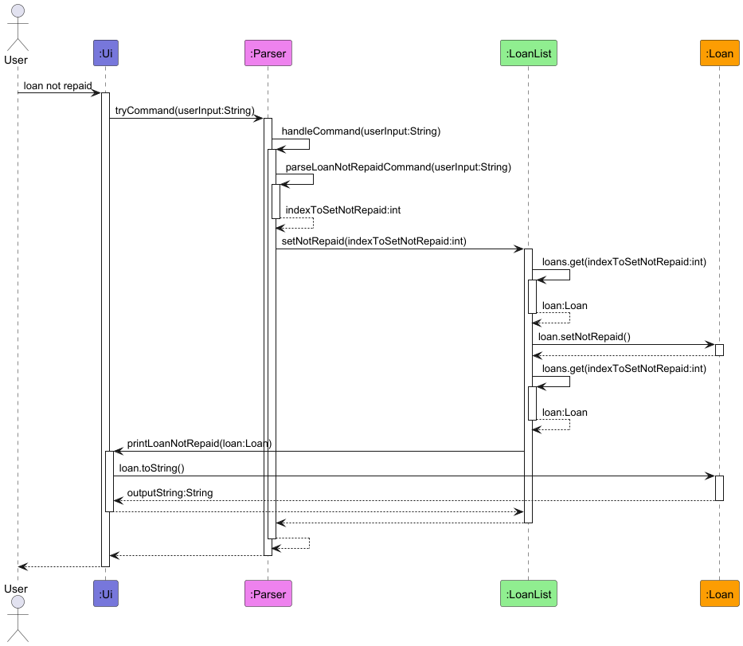
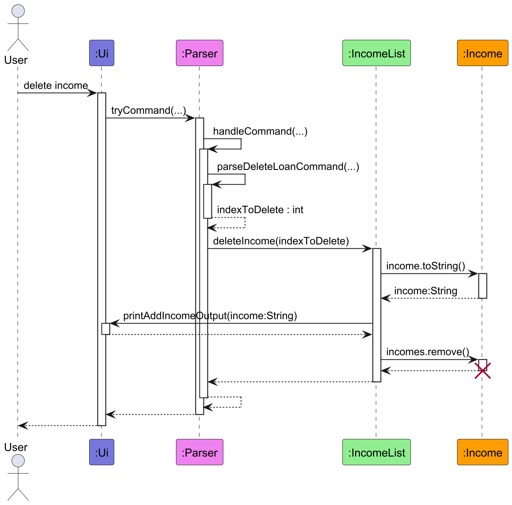
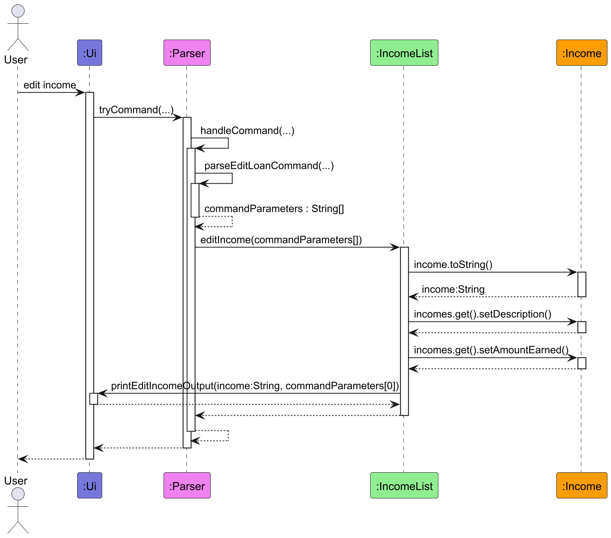
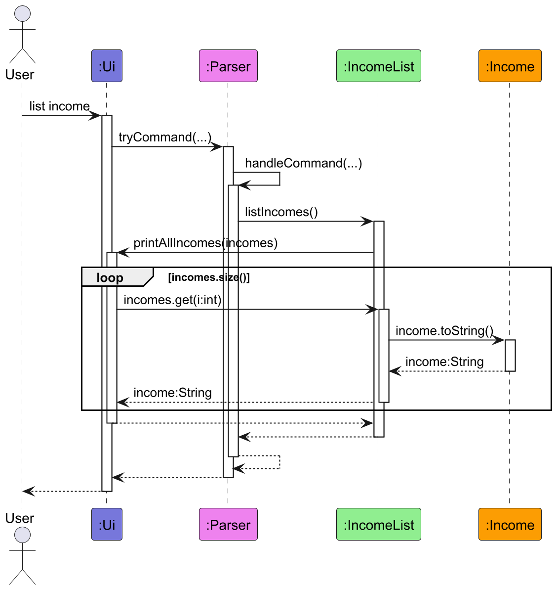
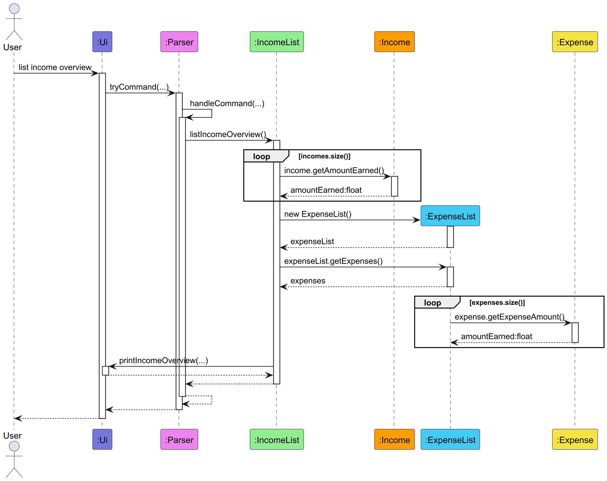
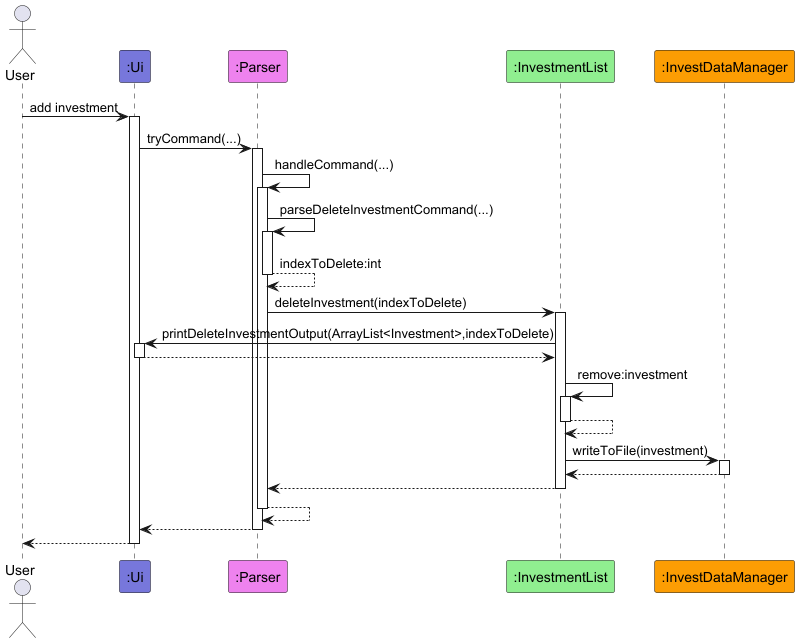
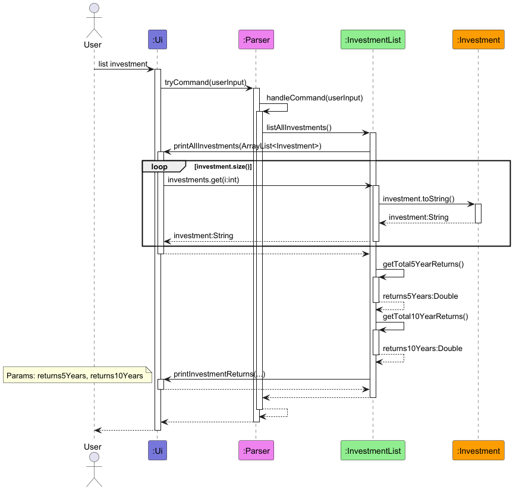

# Developer Guide

## Acknowledgements

{list here sources of all reused/adapted ideas, code, documentation, and third-party libraries -- include links to the original source as well}

## Design & implementation

{Describe the design and implementation of the product. Use UML diagrams and short code snippets where applicable.}

### 1. Design

> [!TIP]
>
> The `.puml` files used to create diagrams are in the `docs/uml` folder. The diagrams can be found in the `docs/diagrams` folder. Refer to the [_PlantUML Tutorial_ at se-edu/guides](https://se-education.org/guides/tutorials/plantUml.html) to learn how to create and edit diagrams.

Main components of the architecture

`Finsight` is in charge of the program launch and shutdown.

* At app launch, it initializes the other components and connects them up with each other.
* At shut down, it shuts down the other components and invokes cleanup methods wherever necessary.

The bulk of the app's work is done by the following four components:

* `UI` : Handles all user interactions. It displays messages, prompts for input, and presents feedback after each 
command execution.
* `Parser` : Acts as the command interpreter and coordinator. It processes user input, identifies the command type, and 
delegates execution to the corresponding list class (e.g., `ExpenseList`, `IncomeList`, `InvestementList`, `LoanList`).
* `Storage` : Manages data persistence. It reads existing data files during startup and writes updated record back to 
disk through specialised `DataManager` subclasses.
* `Model`: Represents the in-memory state of the application. It contains domain objects operations such as add, delete,
 edit etc.


The figure above illustrates the overall class structure of **Finsight**. The Finsight class serves as the entry point 
of the application and depends on the `Ui`, `Parser`, and the four domain lists (`ExpenseList`, `IncomeList`, 
`InvestmentList`, `LoanList`). Each list manages its own set of domain objects through composition relationship (e.g., 
`ExpenseList` contains multiple `Expense` objects). The `Parser` class coordinates commands from the user and delegates 
execution to the respective list classes.

All list classes depend on a specialised data manager `ChildDataManager` (see below on persistence storage), which 
extends the abstract `DataManager` template to handle persistent file operations. The design separates data persistence
(Storage) from domain logic (Model) and user interface (Ui), following a **layered architecture** principle. 
Additionally, static utility methods in the `Ui` class are used for displaying output and user prompts. Composition and 
dependency relationships are used where appropriate to reflect ownership and usage lifetimes.

### 2. Implementation

#### 2.1 Loan Features

##### 2.1.1 List Loan Feature
The List Loan feature enables users to see a list of loans. The `Ui` class takes in the user input. This String is used by the `Parser` class to decide which command to run. `Parser` calls the `listLoans()` method from the `LoanList` class to output the loans. `LoanList` then calls the `Ui` class to output the loans, giving it the ArrayList of Loans. `Ui` class loops through the ArrayList to output each `Loan` class's `toString()` method.


##### 2.1.2 Add Loan Feature
The Add Loan feature enables users to add loans. The `Ui` class takes in the user input. This String is used by the `Parser` class to decide which command to run. `Parser` validates the provided description, amount and date time using the `parseAddLoanCommand` method. `Parser` then calls the `addLoan()` method of the `LoanList` class which creates and add the given `Loan` if valid. Below is the relevance of these attributes:

| Class Attribute | Variable Type | Relevance                                 |
|-----------------|---------------|-------------------------------------------|
| description     | String        | The short description of the loan         |
| amountLoaned    | Double        | The amount loaned                         |
| loanReturnDate  | LocalDateTime | The date and time that the loan is due by |

The `LoanList` class then calls the `Ui` class to print a acknowledgement message in the form of the `toString()` method of the `Loan` class.


##### 2.1.3 Delete Loan Feature
The Delete Loan feature enables the users to delete a loan. The `Ui` class takes in the user input. This String is used by the `Parser` class to decide which command to run. `Parser` validates the provided index using the `parseDeleteLoanCommand` method. `Parser` then calls the `deleteLoan()` method of the `LoanList` class which calls the `Ui` class to print a acknowledgement message using the `toString()` method of the `Loan` class before deleting the `Loan` at the given index. Below is the relevance of these attributes:

| Class Attribute | Variable Type | Relevance                              |
|-----------------|---------------|----------------------------------------|
| index           | int           | The index of the Loan in the ArrayList |




##### 2.1.4 Loan Repaid Feature
The Loan Repaid feature enables the users to set a loan as repaid. The `Ui` class takes in the user input. This String is used by the `Parser` class to decide which command to run. `Parser` validates the provided index using the `parseLoanRepaidCommand` method. `Parser` then calls the `setRepaid()` method of the `LoanList` class which calls the `setRepaid()` method of the `Loan` class before calling the `Ui` class to print a acknowledgement message using the `toString()` method of the `Loan` class. Below is the relevance of these attributes:

| Class Attribute | Variable Type | Relevance                              |
|-----------------|---------------|----------------------------------------|
| index           | int           | The index of the Loan in the ArrayList |



##### 2.1.5 Loan Not Repaid Feature
The Loan Not Repaid feature enables the users to set a loan as not repaid. The `Ui` class takes in the user input. This String is used by the `Parser` class to decide which command to run. `Parser` validates the provided index using the `parseLoanNotRepaidCommand` method. `Parser` then calls the `setNotRepaid()` method of the `LoanList` class which calls the `setNotRepaid()` method of the `Loan` class before calling the `Ui` class to print a acknowledgement message using the `toString()` method of the `Loan` class. Below is the relevance of these attributes:

| Class Attribute | Variable Type | Relevance                              |
|-----------------|---------------|----------------------------------------|
| index           | int           | The index of the Loan in the ArrayList |



##### 2.1.6 Edit Loan Feature
The Edit Loan feature enables users to edit a existing loan. The `Ui` class takes in the user input. This String is used by the `Parser` class to decide which command to run. `Parser` validates the provided index,  description, amount and date time using the `parseEditLoanCommand` method. `Parser` then calls the `editLoan()` method of the `LoanList` class which first deletes the `Loan` at the index before creating a new `Loan` and add the given `Loan` to the ArrayList at the given index. Below is the relevance of these attributes:

| Class Attribute | Variable Type | Relevance                                 |
|-----------------|---------------|-------------------------------------------|
| index           | int           | The index of the Loan in the ArrayList    |
| description     | String        | The short description of the loan         |
| amountLoaned    | Double        | The amount loaned                         |
| loanReturnDate  | LocalDateTime | The date and time that the loan is due by |

The `LoanList` class then calls the `Ui` class to print a acknowledgement message in the form of the `toString()` method of the `Loan` class.


#### 3.1 Income Features

##### 3.1.1 Add Income Feature
The Add Income feature enables users to add income.


##### 3.1.2 Delete Income Feature
The Delete Income feature enables users to delete income.



##### 3.1.3 Edit Income Feature
The Edit Income feature enables users to edit income.



##### 3.1.4 List Income Feature
The List Income feature enables users to view all incomes.



##### 3.1.4 List Income Overview Feature
The List Income Overview feature enables users to view total income, total expenses and remaining income.



#### 2.3 Investment Features

##### 2.3.1 Add Investment Feature
The Add Investment feature allows the user to add investments. The `Ui` class is responsible for handling user input and to output an acknowledgement message. The String from the user input is used by the `Parser` class to decide which command to run. `Parser` then parses the String into the appropriate command parameters exclusive to the command, `add investment`. `Parser` calls the constructor of the `Investment` class with the command parameters and returns the object. This object is then added to an `ArrayList` in the `InvestmentList` entity. The `Ui` class is called by the `InvestmentList` class to output the acknowledgement message, before calling the `appendToFile(...)` method in the `InvestDataManager` Class to add the data of the `Investment` object to a data file.


##### 2.3.2 Delete Investment Feature
The Delete Investment feature allows the user to remove added investments. The `Ui` class is responsible for handling user input and to output an acknowledgement message. The String is passed to the `Parser` class to determine the user-requested command. `Parser` parses the String and retrieves the index of the Investment object that the user wants to delete and calls the `deleteInvestment(indexToDelete)` method in the `InvestmentList` Class with the index. The `Ui` class is called to display an acknowledgement message to the user. The method also removes the respective `Investment` object from the `ArrayList` in the `InvestmentList` entity. `InvestmentList` calls the `writeToFile()` method in the `InvestDataManager` Class to rewrite the data file with the remaining `Investment` objects.


##### 2.3.3 List Investment Feature
The Add Investment feature allows the user to list all the added investments as well as their overall returns. The `Ui` class is responsible for handling user input and to output an acknowledgement message. The String is passed to the `Parser` class to determine the user-requested command. `Parser` parses the String and calls the `listAllInvestments()` method in the `InvestmentList` Class. This method passes the `ArrayList` of `Investment` objects into the `printAllInvestments(...)` method of the `Ui` class. This method loops through each `Investment` object in the `ArrayList` to print their `toString()` method to the user. `InvestmentList` Class then retrieves the overall 5 year and 10 year returns of all the `Investment` objects in the `ArrayList` and calls the `Ui` class to print their values to the user.


---

#### 2.4 Expense Features

##### 2.4.1 List Expense Feature
The List Expense feature allows users to see a list of saved expenses. The `Ui` class takes in the user input as a string "UserInput". This string is used by the `Parser` class to decide which command to execute. `Parser` calls the `listExpense()` method from the `ExpenseList` class to output the expenses. `ExpenseList.listExpense()` will call the `printAllExpenses()` method from `Ui` class. `Ui.printAllExpenses()` loops through the ArrayList to output each `Expense` class's `toString()` method.


##### 2.4.2 Add Expense Feature
The Add Expense feature enables users to add their expenses. The `Ui` class takes in the user input as a string "UserInput". Once the `Parser` class check that it is the correct command, `Parser` also validates the provided description and amount using `parseAddExpenseCommand()` method. After validation, `Parser` then calls `addExpense()` method of `ExpenseList` class and adds the new `Expense`. The `ExpenseList` class then calls `printAddExpenseOutput()` method of `Ui` class which prints an acknowledgment message that the new `Expense` has been added.

Below is the parameters that `Parser` checks during `parseAddExpenseCommand()`

| Class Attribute | Variable Type | Relevance                            |
|-----------------|---------------|--------------------------------------|
| description     | String        | The short description of the expense |
| expenseAmount   | Double        | The amount used                      |


##### 2.4.3 Delete Expense Feature
The Delete Expense feature enables users to delete their saved expenses. The `Ui` class takes in the user input as a string "UserInput". Once the `Parser` class check that it is the correct command, `Parser` also check the provided index using `parseDeleteExpenseCommand()` method. After validation, `Parser` then calls `deleteExpense()` method of `ExpenseList` class and delete the selected `Expense`. The `ExpenseList` class then calls `printDeleteExpenseOutput()` method of `Ui` class which prints an acknowledgment message that the selected `Expense` has been deleted.

Below is the parameters that `Parser` checks during `parseDeleteExpenseCommand()`

| Class Attribute | Variable Type | Relevance                                               |
|-----------------|---------------|---------------------------------------------------------|
| index           | Integer       | The index of the expense to be deleted in the ArrayList |


#### 2.5 Storage Features

##### 2.5.1 Overview
The ```DataManager``` class is an **abstract base class** that defines the general mechanism for reading and writing 
text-base data files used throughout Finsight (e.g., Loans, Income).

It encapsulates all **low-level file I/O** responsibilities such as:

- Ensuring directories and files exist
- Performing atomic writes to prevent corruption
- Managing file append/overwrite operations
- Providing reusable sanitisation utilities

This allows child class (e.g., ```LoanDataManager```, ```IncomeDataManager```) to focus purely on **domain-specific 
parsing logic**.

##### 2.5.2 Class Diagram


**Design Principle**: Follows **Template Method pattern**, ensuring each subclass only defines its own record formatting
rules while sharing consistent I/O logic. The abstract methods allow subclasses to fill in the data-specific steps such 
as path and file name (```./data/{category}.txt```).

##### 2.5.3 Loading Data

When ```tryLoad()``` is called
1. It first call ```ensureFileExist()``` to create missing folders/files.
2. Read all line in UTF-8.
3. Ignore blank lines.
4. Passes each line into corresponding subclass's ```parseRecord(String)``` for conversion into domain objects.
5. Returns list of valid records.
6. If error occurs (I/O or parsing), it catches the exception, prints the error and returns an empty list.


##### 2.5.4 Writing and Appending Data

Two operations are supported:

- ```writeToFile(List<T>)``` --- overwrites the file with all current records.
- ```appendToFile(T)``` --- appends a single record at the end of the file.

Both ensure the file exists before writing. ```writeToFile()``` writes to a temporary ```.temp``` file first and then
atomically replaces the target file to ensure data consistency even during program termination.

``` java
Files.move(tmp, dataFilePath(), 
StandardCopyOption.REPLACE_EXISTING, 
StandardCopyOption.ATOMIC_MOVE);
```

##### 2.5.5 File Safety Utilities

`ensureParentDir()` expects to find folder `data` in current directory. Method creates directory if missing.

`ensureFileExist()` expects `{category}.txt` in `data` folder. Method creates expected files and folder if missing 
(by invocating `ensureParentDir()`).

`sanitize()/unsanitize()` are helper methods that encode and decode reserved symbols that conflict with the text 
file's delimiter system. Since each record line uses the pipe (`|`) character as a delimiter between fields, any literal
 pipe within user input must be escaped before writing to disk. The implementation replaces:
  - `%` with `%25` (encoded percent)
  - `|` with `%7C` (encoded pipe)

The unsanitize() method restores them during file loading by performing the inverse replacements.

```text
Input: "Lunch | Promo 50%"
Stored: "Lunch %7C Promo 50%25"
Restored: "Lunch | Promo 50%"
```

This ensures that no field content breaks the delimiter structure and that user data is always preserved exactly as 
entered.

##### 2.5.6 Writing to storage

```writeToFile()``` is called whenever there are edits or deletion to the data. It first ensures that path to the file 
exist and is valid. A temporary file will be created with the new list of records written into it. Then, the original 
.txt file will be replaced by the temporary file created. 

###### 1. Client Invocation

The client calls ```writeToFile()``` on a ```ChildDataManager``` instance. Control passes to the superclass 
`DataManager`.

###### 2. File Preparation

The method calls ```ensureFileExist()```, which invokes ```ensureParentDir()```. This ensures that output path is always
valid before writing.

###### 3. Temporary File Generation

The data manager retrieves the file name via ```Path.getFileName()``` and constructs a sibling temporary path by call 
```Path.resolveSibling(fileName + ".temp")```. This creates a temporary file in the same directory as the target file, 
ensuring the eventual replacement can happen atomically.

###### 4. Opening the Writer

The method calls ```Files.newBufferedWriter()``` to obtain a `BufferedWriter` object ```writer``` configured for UTF-8 
encoding. The writer will buffer and write the serialised text content efficiently.

###### 5. Record Serialisation and Writing Loop

For each record in the list, ```formatRecord(record)``` is invoked as a **polymorphic call** resolved at runtime to the 
subclass implementation, converting domain objects into delimited text lines. The resulting string is written to the 
buffer using ```writer.write()```, followed by ```writer.newLine()``` to ensure each record starts on a separate line.

###### 6. Closing the writer

After all records are written, the write is closes through try-with-resources. Closing ensures all buffered data is 
flushed to the temporary file and system resources are releases.

###### 7. Atomic File Replacement

The method calls ```Files.move()``` to rename and replace the original data file with the new ```.temp``` file. The 
options ```REPLACE_EXISTING``` and ```ATOMIC_MOVE``` ensure the replacement is performed safely in a single atomic 
filesystem operation. This prevents partial writes, preserving data integrity. Once the move is successful, control 
returns to the client and the data file now contains the latest version of all serialised records.


##### 2.5.7 Adding new record to file

```appendToFile()``` is called when a new record is added to the file. The file preparation is identical to ```
writetoFile()```. However, unlike ```writeToFile``` where the entire file is rewritten and replaced, this method using 
```StandardOpenOption.APPEND``` to append the new record to the last line of the file, and adds a new line.


# Appendix
## Product scope
### Target user profile

- University students with poor finance management
- can type fast
- prefers typing to clicking
- is comfortable using CLI apps

### Value proposition

Manage loans, income, investments and expenses faster than a GUI driven app.

## User Stories

| Version | As a ... | I want to ...             | So that I can ...                                           |
|---------|----------|---------------------------|-------------------------------------------------------------|
| v1.0    | new user | see usage instructions    | refer to them when I forget how to use the application      |
| v2.0    | user     | find a to-do item by name | locate a to-do without having to go through the entire list |

## Non-Functional Requirements

1. Should work on any *mainstream OS* as long as it has Java `17` or above installed.
2. A user with above average typing speed for regular English text (i.e. not code, not system admin commands) should be able to accomplish most of the tasks faster using commands than using the mouse.
3. Must never corrupt data on crash/power loss during save.
4. Must auto-save after every state-mutating command.
5. Must store data as *UTF-8* text files under `./data`. Line endings must be cross-platform tolerant.

{More to be added}

## Glossary

* *mainstream OS* - Windows, Linux, Unix, MacOS
* *GUI* - Graphical User Interface
* *UTF-8* - Unicode Transformation Format - 8 bit

## Instructions for manual testing

### Launching and shutdown

1. Initial Launch
   1. Download the jar file [here](https://github.com/AY2526S1-CS2113-T10-1/tp) into an empty folder
   2. Run the jar file by `cd` into the folder and running the `java -jar finsight.jar` command
   3. Run the `bye` command <br/>
      Expected: Program creates empty data files in a data folder in the original folder

### List Loan

1. Show List of Loans (empty)
   1. Prerequisites: no loans saved or initial launch
   2. Test case: `list loan`<br/>
      Expected: Shows `Total loaned: $0.00`
<br/><br/>
2. Show List of Loans (not empty)
   1. Prerequisites: loan list is not empty
   2. Test case: `list loan`<br/>
      Expected: Shows a list of all loans and a Total loaned amount

### Add/Edit Loan

1. Adding a new Loan
   1. Test case: `add loan d/ loan 1 a/ 1000 r/ 10-10-2209 19:00`<br/>
      Expected: A loan is added to the loanList, can be shown with the `list loan` command
   2. Test case: `add loan d/ loan 2 a/ 1000.55 r/ 11-11-2028 12:59`<br/>
      Expected: A loan is added to the loanList, can be shown with the `list loan` command
<br/><br/>
2. Editing a Loan
   1. Prerequisites: At least 2 loans shown when running the `list loan` command
   2. Test case: `edit loan 1 d/ edited loan 1 a/ 1000 r/ 10-10-2209 19:00`<br/>
      Expected: The first loan shown by the `list loan` command has description changed from `loan 1` to `edited loan 1`
   3. Test case: `add loan d/ edited loan 2 a/ 1000.55 r/ 11-11-2029 12:59`<br/>
      Expected: The second loan shown by the `list loan` command has description changed from `loan 2` to `edited loan 2` and year of loan return date changed from `2028` to `2029`

### Delete Loan

1. Deleting a Loan
   1. Prerequisites: At least 2 loans shown when running the `list loan` command
   2. Test case: `delete loan 1` <br/>
      Expected: The loan originally shown as loan 1 is deleted and the original 2nd loan is now shown as the 1st loan

### Set Repaid/Set Not Repaid

1. Set Loan to be Repaid / Not Repaid
   1. Prerequisites: At least 1 loan shown when running the `list loan` command
   2. Test case: `loan repaid 1` <br/>
      Expected: `list loan` command shows 1st loan as repaid
   3. Test case: `loan not repaid 1`
      Expected: `list loan` command shows 1st loan as outstanding

### List Expenses
1. Show List of expense 
   1. Test case: `list expense` <br/>
   Expected (if not empty): Shows a list of all expense's description and amount
   3. Expected (if empty): Shows nothing

### Add Expense
1. Adding an expense
   1. Test case: `add expense d/pencil a/2` <br/>
   2. Test case: `add expense d/drinks a/5` <br/>
   Expected: Either expense is added to the expenseList. Can be seen via `list expense` command.

### Delete Expense
1. Deleting an expense
   1. Prerequisites: At least 1 Expense saved; or shown when using `list expense` command
   2. Test case: `delete expense 1` <br/>
   Expected: The first expense is deleted from the list. Details of the deleted expense shown in the status message.


### Persistence

1. Enter any valid command and ensure it is saved by entering `list {category}`.
2. Enter ```bye``` to exit the program.
3. Navigate to the `./data` folder and select the category. The data entered will be saved within the category's `.txt`
file.
4. Alternatively, run the program again and enter `list {category}`. Output should be the same as output list seen in 
`Step 1`.