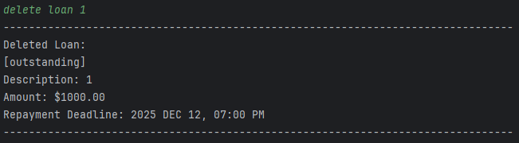
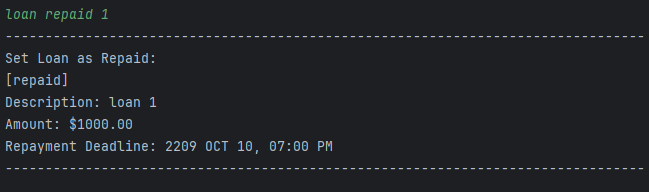
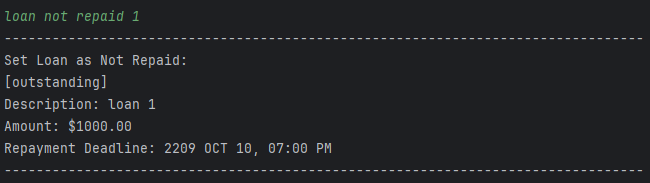
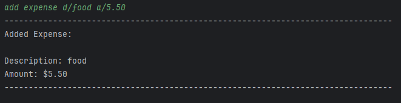
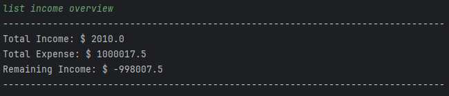
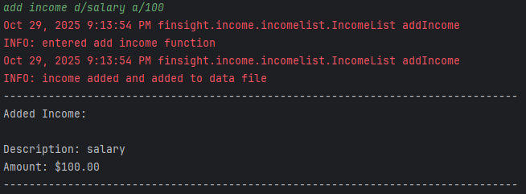
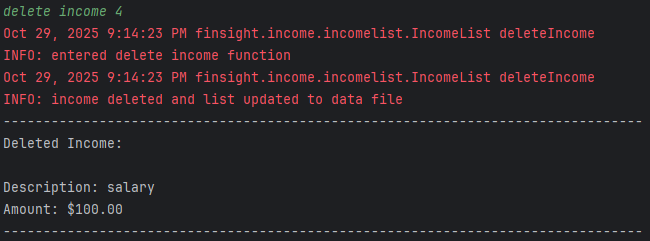
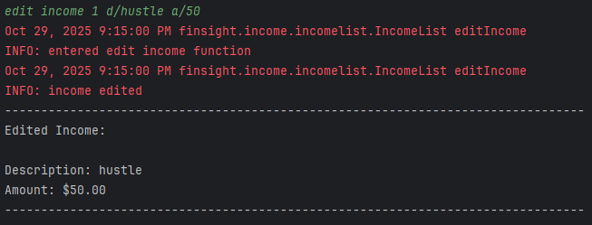
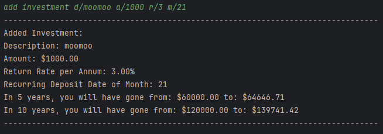

# User Guide

## Introduction

FinSight is a CLI-based app for managing finances such as income, expenses, loans and investments.

* [Quick Start](#quick-start)
* [Features](#features)
* **Loans**
    * [List loan](#list-all-loans-list-loan)
    * [Add loan](#add-a-loan-add-loan)
    * [Delete loan](#delete-a-loan-delete-loan)
    * [Loan repaid](#set-loan-as-repaid-loan-repaid)
    * [Loan not repaid](#set-loan-as-not-repaid-loan-not-repaid)
    * [Edit loan](#edit-a-loan-edit-loan)
* **Expense**
    * [List expense](#list-all-expenses-list-expense)
    * [add expense](#add-expense-add-expense)
    * [delete expense](#delete-expense-delete-expense)
* **Income**
    * [list income](#list-all-incomes-list-income)
    * [add income](#add-income-add-income)
    * [delete income](#delete-income-delete-income)
    * [edit income](#edit-income-edit-income)
    * [list income overview](#view-income-overview-list-income-overview)
* **Investment**
    * [list investment](#list-all-investment-list-investment)
    * [add investment](#add-investment-add-investment)
    * [delete investment](#delete-investment-delete-investment)
*  [Help](#command-help-help)
*  [Exiting the program](#exit-the-program-bye)
*  [Saving the data](#saving-the-data)
*  [FAQ](#faq)
*  [Command Summary](#command-summary)

---

 

## Quick Start

1. Ensure that you have Java `17` or above installed.
2. Download the latest version of `FinSight` from [here](https://github.com/AY2526S1-CS2113-T10-1/tp).
3. Copy the file to the folder you want to use as the home folder for FinSight.
4. Open a command terminal, `cd` into the folder you put the jar file in, and use the `java -jar finsight.jar` command to run the application.
5. Type the command into the terminal and press Enter to execute it. Any input given that is not a correct command will show all possible commands.
6. Refer to the [Features](#features) below for details of each command.

## Features

> ℹ️ NOTE
> * Words in `<UPPER_CASE>` are the parameters to be supplied by the user. 
    e.g. in `delete loan <INDEX>`, `<INDEX>` is a parameter which can be used as `delete loan 1`.
>
> * Parameters must be in exact order. 
    e.g. if the command specifies `d/<DESCRIPTION> a/<AMOUNT>`, the exact order must be followed for the command to work.
>
> * Extraneous parameters for commands that do not take in parameters (such as `list loan`, `list expense`, `list investment`, `list income` and `bye`) will be ignored. 
    e.g. if the command specifies `bye 123`, it will be interpreted as `bye`.
>
> * If you are using a PDF version of this document, be careful when copying and pasting commands that span multiple lines as space characters surrounding line-breaks may be omitted when copied over to the application.

 

### List all loans: `list loan`
Prints the list of all loans onto the terminal with an index starting from 1.

Format: `list loan`

### Add a loan: `add loan`
Adds a loan to the list. The loan will include a description and the amount borrowed as well as the date and time to return the loaned amount by.

Format: `add loan d/ <DESCRIPTION> a/ <AMOUNT_BORROWED> r/ <LOAN_RETURN_DATE_AND_TIME>`

* The `<AMOUNT_BORROWED>` cannot contain punctuation and must be a positive value.
* The `<LOAN_RETURN_DATE_AND_TIME>` must be of format (DD-MM-YYYY HH:mm).

Example of usage:

`add loan d/ loan 1 a/ 10000 r/ 10-10-2026 19:00`

`add loan d/ loan 2 a/ 10.56 r/ 11-10-2056 23:59`

### Delete a loan: `delete loan`
Deletes the loan at <INDEX> from the list of loan

Format: `delete loan <INDEX>`

* The `<INDEX>` cannot contain punctuation.

Example of usage:

`delete loan 1`

`delete loan 3`

### Set loan as repaid: `loan repaid`
Sets the loan at <INDEX> as repaid

Format: `loan repaid <INDEX>`

* The `<INDEX>` cannot contain punctuation.

Example of usage:

`loan repaid 1`

`loan repaid 3`

### Set loan as not repaid: `loan not repaid`
Sets the loan at <INDEX> as not repaid

Format: `loan not repaid <INDEX>>`

* The `<INDEX>` cannot contain punctuation.

Example of usage:

`loan not repaid 1`

`loan not repaid 3`

### Edit a loan: `edit loan`
Edits a loan in the list. The loan will include a description and the amount borrowed as well as the date and time to return the loaned amount by.

Format: `edit loan <INDEX> d/<DESCRIPTION> a/<AMOUNT_BORROWED> r/<LOAN_RETURN_DATE_AND_TIME>`

* The `<INDEX>` cannot contain punctuation.
* The `<AMOUNT_BORROWED>` cannot contain punctuation and must be a positive value.
* The `<LOAN_RETURN_DATE_AND_TIME>` must be of format (dd-MM-yyyy HH:mm).

Example of usage:

`edit loan 1 d/loan 1 a/10000 r/10-10-2026 19:00`

`edit loan 2 d/loan 2 a/10.56 r/11-10-2056 23:59`

### List all expenses: `list expense`
Prints the list of all expenses onto the terminal, with starting index of 1

Format: `list expense`

### Add expense: `add expense`
Adds an expense to the list. The expense will include a description and the amount spent.

Format: `add expense d/<DESCRIPTION> a/<AMOUNT_SPENT>`

- `<AMOUNT_SPENT>` must be a positive value.

Example of usage: `add expense d/food a/5.50`

### Delete expense: `delete expense`
Deletes the expense from the list.

Format: `delete expense <INDEX>`

* The `<INDEX>` cannot contain punctuation.

Example of usage: `delete expense 2`

### List all incomes: `list income`
Prints the list of all incomes onto the terminal, with starting index of 1

Format: `list income`

### View income overview: `list income overview`
Prints total income, total expenses and remaining income.

Format: `list income overview`

### Add income: `add income`
Adds an income to the list. The income will include a description and the amount earned.

Format: `add income d/<DESCRIPTION> a/<AMOUNT_EARNED>`

* The `<AMOUNT_EARNED>` should be a positive numerical value.

Example of usage: `add income d/salary a/100`

### Delete income: `delete income`
Deletes the income from the list.

Format: `delete income <INDEX>`

* The `<INDEX>` cannot contain punctuation.

Example of usage: `delete income 1`

### Edit income: `edit income`
Edits the income at <INDEX> from the list of income.

Format: `edit income <INDEX> d/<DESCRIPTION> a/<AMOUNT_EARNED>`

* The `<INDEX>` cannot contain punctuation.
* The `<AMOUNT_EARNED>` should be a positive numerical value.

Example of usage: `edit income 1 d/hustle a/50`

### List all investment: `list investment`
Prints the list of all investment onto the terminal, with starting index of 1.
Also prints the total returns after 5 and 10 years.

Format: `list investment`

### Add investment: `add investment`
Adds an investment to the list. The investment will include a description, the monthly invested amount,
the return rate, and the deposit date.

Format:`add investment d/<DESCRIPTION> a/<AMOUNT_INVESTED_MONTHLY> r/<RETURN_RATE_PER_ANNUM> m/<DEPOSIT_DATE_EACH_MONTH>`

- `<AMOUNT_INVESTED_MONTHLY>`, `<RETURN_RATE_PER_ANNUM>`, and `<DEPOSIT_DATE_EACH_MONTH>` must be a positive numerical value.

Example of usage: `add investment d/moomoo a/1000 r/3 m/21`

### Delete investment: `delete investment`
Delete the investment from the list.

Format: `delete investment <INDEX>`

Example of usage: `delete investment 3`

 

### Command Help: `help`
Shows the list of possible commands.

Format: `help`

 

### Exit the program: `bye`
Saves all current data and exits the program

Format: `bye`

### Saving the data

FinSight automatically saves all data you enter:

- Expenses
- Incomes
- Investments
- Loans (including repaid/not repaid status and due dates)

#### Where the files are

All data is stored as plain text in a folder name `data` inside the FinSight app directory:

| Category    | File                  |
|-------------|-----------------------|
| Expenses    | `data/expense.txt`    |
| Incomes     | `data/income.txt`     |
| Investments | `data/investment.txt` |
| Loans       | `data/loan.txt`       |

> Tip: if you move the app to another computer, copy the whole `data/` folder along with it.

#### When it saves

- FinSight **auto-saves after every command** that changes data (add/edit/delete etc.).
- On first run, if the `data/` folder or files don't exist, FinSight creates them automatically.

#### File format

- Files are **UTF-8** text; each line is one record.
- FinSight uses `|` internally as a field separator and encodes special characters so that descriptions can safely 
contain `|` and `%`.
- **Recommendation**: You don't need to edit these files by hand. If you do, use a plain-text editor and keep each 
record on a single line.

#### Backing up your data

1. Close FinSight.
2. Copy the entire `data/` folder to your backup location.
3. To restore, replace the existing `data/` folder with your backup copy.

#### Moving data to another computer
- Copy the FinSight app folder **and** the `data/` folder to the new computer. 
- Start FinSight. Your entries will appear automatically.

#### Resetting data (start fresh)

- Exit FinSight and delete the `data/` folder, or rename it.
- Start FinSight. It will create a new empty `data/` folder and files.

---

 

## FAQ

**Q**: How do I transfer my data to another computer?

**A**: Install the app in the other computer and overwrite the empty data files it creates with the files that contains the data of your previous FinSight home folder.

---

 

## Command Summary

| Action                 | Format, Examples                                                                                                                                                       |
|------------------------|------------------------------------------------------------------------------------------------------------------------------------------------------------------------|
| List Loans             | `list loan`                                                                                                                                                            |
| Add a Loan             | `add loan d/<DESCRIPTION> a/<AMOUNT_LOANED> r/<LOAN_RETURN_DATE_AND_TIME>`  e.g. `add loan d/loan1 a/10.55 r/10-10-2056 23:59`                                     |
| Delete a Loan          | `delete loan <INDEX>`  e.g. `delete loan 1`                                                                                                                        |
| Set Loan as Repaid     | `loan repaid <INDEX>`  e.g. `loan repaid 1`                                                                                                                        |
| Set Loan as Not Repaid | `loan not repaid <INDEX>`  e.g. `loan not repaid 1`                                                                                                                |
| Edit a Loan            | `edit loan <INDEX> d/<DESCRIPTION> a/<AMOUNT_LOANED> r/<LOAN_RETURN_DATE_AND_TIME>`  e.g. `edit loan 1 d/loan1 a/10.55 r/10-10-2056 23:59`                         |
| List Expense           | `list expense`                                                                                                                                                         |
| Add an Expense         | `add expense d/<DESCRIPTION> a/<AMOUNT_SPEND>`  e.g. `add expense d/food a/6`                                                                                      |
| Delete An Expense      | `delete expense <INDEX>`  e.g. `delete expense 2`                                                                                                                  |
| List Income            | `list income`                                                                                                                                                          |
| View Income Overview   | `list income overview`                                                                                                                                                 |
| Add Income             | `add income d/<DESCRIPTION> a/<AMOUNT_EARNED>`  e.g. `add income d/salary a/100`                                                                                   |
| Delete a Income        | `delete income <INDEX>`  e.g. `delete income 1`                                                                                                                    |
| Edit a Income          | `edit income <INDEX> d/<DESCRIPTION> a/<AMOUNT_EARNED>`  e.g. `edit income 1 d/hustle a/50`                                                                        |
| List Investments       | `list investment`                                                                                                                                                      |
| Add an Investment      | `add investment d/<DESCRIPTION> a/<AMOUNT_INVESTED_MONTHLY> r/<RETURN_RATE_PER_ANNUM> m/<DEPOSIT_DATE_EACH_MONTH>`  e.g. `add investment d/moomoo a/1000 r/3 m/21` |
| Delete an Investment   | `delete investment <INDEX>`  e.g. `delete investment 3`                                                                                                            |
| Exit Program           | `bye`                                                                                                                                                                  |
